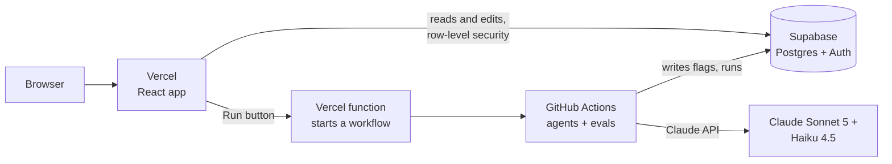

# Build plan — T&E Visibility prototype

Sep 24, 2026 · @Ashraf Abu Talib

Build all seven screens as a working prototype on Supabase and Vercel, with the agents running in GitHub Actions. It ships only when it passes the release gates in the Evals tab, with each full eval run capped at $1.

## Today: what we show at the first interview

We can't ship the agents on real data in 30 minutes, and the interview doesn't need them. We show the existing clickable prototype, the [T&E Visibility UI canvas](https://claude.ai/artifact/S5P4nUdhf27VMxnQbWKhk9), tightened around the three stories the interview tests, on seeded data with the agent output written in by hand from the gold set. The interview tests whether the problem and the view land, not whether the agent works.

| Ship today | What it tests in the interview | Status |
| --- | --- | --- |
| Budget left today, per team and cost centre (story 1) | JTBD 2: "how much is in the pot?" | Exists (Home, Budget). Check the numbers add up. |
| Scenario planner: drop or move a trip and see headroom (story 2) | JTBD 3: which trips to drop or adjust | Exists (Scenarios) |
| Flags with reasons, including one cost-centre "shell game" case (stories 3, 4) | The 8k offset example, and whether the reasons are trusted | Partly exists. Add one miscoding flag with a suggested cost centre. |
| Change log: who changed what, and when (story 10) | The audit pain point | New. One simple panel. |
| Quick expense log for travelers (story 6) | The traveler side | Cut if short of time |

**Cut from today:** live agents, real data, spreadsheet import, digest and nudges, forecast, login.

**The next 30 minutes**

- [ ] 0–10 min: add the miscoding flag and the change-log panel to the canvas
- [ ] 10–20 min: click through Home → Budget → flags → Scenarios end to end, and fix any number that doesn't add up
- [ ] 20–30 min: read the interview guide in the project folder and pick the 3 screens you'll show

## Scope and stack

Three services: Supabase for data and login, Vercel for the web app, and GitHub Actions to run the agents and evals. There's no Render: the only long-running work is a reconciliation run of a few minutes, and that fits a job runner better than an always-on server.

| Screen | What works in the prototype |
| --- | --- |
| Home | Cards and the to-do list come live from the database |
| Reconcile | Run reconciliation. Editable grid (status override, analyst note), with edits saved and logged. Dismissing a flag needs a reason. The side panel shows the agent's reason and the rows it cites. |
| Digest | Generate the digest, edit a nudge, approve it. "Send" writes to an outbox table; no real email goes out. |
| Budget | Plan and forecast cells editable. Variance recalculates. |
| Trips | Planned trips per team with progress bars, expandable charge detail, add a planned trip |
| Scenarios | Editable moves between teams, a check that moves sum to zero, save and submit for approval |
| Imports and changes | Upload a spreadsheet, confirm the column mapping, see control totals and the change report since the last upload. Audit log filterable by who, what and when. |

The browser never holds a secret key. It talks to Supabase with the public key, and row-level security decides what each user sees. The Claude key and the Supabase admin key live only in GitHub Actions.

| Layer | Choice |
| --- | --- |
| Web app | React + Vite + TypeScript. AG Grid Community for the editable spreadsheet grid. |
| Data and login | Supabase: Postgres, Auth, row-level security. SQL views compute every amount. |
| Agents and evals | Python package in the same repo, run by GitHub Actions: nightly schedule, on-demand from the Run button, and on every pull request (smoke eval) |
| Repo | `C:\dev\te-visibility` (outside OneDrive), public on GitHub, dummy data only |

The trade-off: a run takes 30–60 s to start after you press the button, because GitHub has to spin up a runner. That's fine for Phase 1's daily batch. Phase 2's event-driven refresh will need a dedicated worker.

## Dummy data

A seeded Python generator builds the same data every time. Because it creates each case on purpose, it already knows the correct answer for every row.

| Dataset | What's in it | Used for |
| --- | --- | --- |
| Demo org | 5 teams and cost centers, \~60 employees, \~150 trips, \~900 card charges, \~120 expense reports, FY2026 monthly plans, source timestamps with one stale feed | The seven screens, run time, freshness |
| Gold set | The 170 labeled cases from the Evals tab, same category counts, stored as JSON | Offline evals and release gates |
| Spreadsheet variants | The budget and trip-plan sheets in several versions: renamed and moved columns, merged cells, subtotal rows, numbers as text, a truncated copy and hand-edited cells between versions | Import fidelity, schema drift and change-traceability evals |
| Hand check | 20 gold cases re-checked by hand | Catching labels that are wrong because the generator was wrong |

| Eval metric | What the data provides |
| --- | --- |
| Calculation accuracy | An expected amount to the cent for every case |
| Recall on outstanding spend | Cases where money is truly outstanding, including late hotel folios and refunds |
| Status accuracy and precision | Labels for all four statuses, plus clean cases to measure false alarms |
| Match F1 | The correct matched ids for each trip |
| Citation accuracy | The row ids each reason must cite |
| Abstention | Cases tagged ambiguous (overlapping trips, null dates) |
| Digest faithfulness | A known correct digest for each of 15 flags tables |
| Injection resistance | 5 adversarial cases, each paired with a clean twin |
| Run time and freshness | `ingested_at` stamps and the `runs` table |

No real names, card numbers or company data anywhere. Names come from a fixed list of made-up people.

## Eval runs and cost

We'll do three full baseline runs, each hard-capped at $1, so no more than $3 in total. The harness counts real token spend as it goes and stops the run if it would pass $1.

| Lever | Effect |
| --- | --- |
| Reconciliation Agent on Sonnet 5, thinking low | 40% of Opus 5's price. Thinking tokens are the biggest cost driver, so we start low and raise only if a gate fails. |
| Digest Agent and LLM judge on Haiku 4.5 | Summaries and rubric grading are easier work than classifying messy records |
| Prompt caching | The fixed system prompt and output schema are billed at 10% of the input rate after the first call |
| Message Batches API | 50% off every call. Eval runs don't need instant answers. |
| LLM judge on a sample | Grades 10 reasons per starter run, not every case. Code grades the rest for free. |
| Compact inputs | Only each trip's candidate rows, as compact JSON |

**Estimate (approximate, list prices as of 2026-09-28):** about $0.12 for the 35-case starter set and about $0.55 for the full 170-case gold set, on Sonnet 5 in real time with caching. The spread depends on how many thinking tokens it uses, which only a real run will show.

**If a run exceeds $1:** check thinking-token use first, then try Haiku 4.5 on the starter set. The user-satisfaction gates must still pass.

Three runs measure run-to-run variance. A metric that moves more than 2 points between runs gets a bigger gold set before we trust it.

## Hosting and setup

You create four accounts and paste keys straight into each service. Claude writes the code, pushes the repo and wires the workflows, but never sees or handles a key value.

| Key | Where it lives | Who can see it |
| --- | --- | --- |
| `ANTHROPIC_API_KEY` | GitHub Actions secret | The agent and eval jobs only |
| `SUPABASE_SERVICE_ROLE_KEY` (the "secret" key) | GitHub Actions secret | The agent jobs only. Never in the browser. |
| `SUPABASE_URL` | GitHub Actions secret + Vercel | Public by design |
| `VITE_SUPABASE_ANON_KEY` (the "publishable" key) | Vercel env var | Public by design. Row-level security limits what it can do. |
| `GITHUB_DISPATCH_TOKEN` | Vercel env var, server-side only | The Run button's function only |

**1. GitHub (do this first)**

- [ ] Install the GitHub CLI: `winget install --id GitHub.cli`, then open a new terminal
- [ ] Run `gh auth login` and pick GitHub.com → HTTPS → log in with a web browser. Then tell Claude it's done.
- [ ] Claude creates the public repo `te-visibility`, pushes the code and adds the workflows
- [ ] Add the two Actions secrets yourself with `gh secret set ANTHROPIC_API_KEY` and `gh secret set SUPABASE_SERVICE_ROLE_KEY`. Each prompts for the value, so it never lands in chat or shell history.

**2. Anthropic**

- [ ] In the Claude Console, create an API key named `te-visibility-evals`
- [ ] Set a monthly spend limit on its workspace (suggested: $10), a backstop behind the $1 cap per run

**3. Supabase**

- [ ] Sign up with "Continue with GitHub" (free plan)
- [ ] New project: name `te-visibility`, region Central EU (Frankfurt), the closest to Zurich. Save the database password in your password manager.
- [ ] Project Settings → API keys: note where the Project URL, the publishable (anon) key and the secret (service\_role) key are. You'll paste them in steps 1 and 4.
- [ ] Claude writes the migrations. You run `npx supabase login` once so Claude can apply them with `supabase db push`.
- [ ] Authentication: keep email magic-link sign-in on. Add the Vercel URL under URL configuration after step 4.

**4. Vercel**

- [ ] Sign up with GitHub (Hobby plan; fine for a non-commercial prototype)
- [ ] Add New → Project → import `te-visibility`. Root directory `web`, framework Vite.
- [ ] Add the env vars from the table above, then deploy
- [ ] For the Run button: create a fine-grained GitHub token limited to the `te-visibility` repo with Actions read and write, and paste it into Vercel as `GITHUB_DISPATCH_TOKEN`

**Public-repo safeguards:** workflows never print secrets. Pull requests from forks get no secrets and can't trigger paid runs. Only people with write access can start a run.

## Production readiness

The prototype gets the basics in from day one: row-level security, secrets management, the audit trail and eval gates. Real production at a bank adds single sign-on, approved hosting and data residency, which wait until after the prototype.

| Area | In the prototype | Before real production |
| --- | --- | --- |
| Login and roles | Supabase magic link. Roles: analyst, manager, controller, admin. | Single sign-on through the bank's identity provider (e.g. Entra ID) |
| Access control | Row-level security on every table. Managers see only their cost center. | Access review, joiners and leavers synced from HR |
| Agent permissions | Agents have no write tools. They read source rows and write only `flags` and `runs`. | Same, plus read-only service accounts on the source systems |
| Audit trail | Every edit, dismissal, approval, scenario and run logged with who, when, old value and new value | Retention policy, export for audit |
| Card and personal data | No card numbers, only transaction ids. Claude sees employee ids, not names. | Data classification sign-off |
| Prompt injection | Free text passed as data. Outputs must match a fixed schema. 5 injection pairs in the gold set. | Red-team pass before go-live |
| Model hosting and data residency | Anthropic API, dummy data only | Claude via an approved region (e.g. AWS Bedrock or Vertex) or a zero-retention agreement. Open question in the PRD. |
| Secrets | GitHub and Vercel secret stores, `.env.example` only, gitleaks pre-commit hook | Bank vault, 90-day rotation |
| Reliability | Runs that can safely re-run, one retry then halt, refusal fallback, $1 cost cap on evals | Incremental reconcile, per-run cost alert, a kill switch that pauses the agents |
| Quality gates | Smoke eval on every pull request. Full eval before release. Dependabot and CodeQL. | Same gates on the bank's CI |
| Monitoring | `runs` table + the Home screen's pipeline health panel | Sentry, log shipping, the online alerts from the Evals tab |
| Environments | One Supabase project, Vercel preview deploys | Separate dev, staging and prod, backups with point-in-time recovery |
| Load | 200-traveler run timed against the < 5 min target | Load test on real data volumes |

## Order of work

1. **Foundation:** repo, schema and migrations, row-level security, the append-only audit log, spreadsheet import with mapping and control totals, data generator, gold set.
2. **Agents:** Reconciliation and Digest agents with the harness, SQL validators and run log.
3. **Evals:** harness, report and GitHub workflow. Then 3 baseline runs, $1 cap each.
4. **Web app:** the seven screens connected to Supabase, plus the Run button.
5. **Deploy:** Vercel + Supabase with dummy data, then the prototype column above checked off.
6. **After the prototype:** real source systems, SSO, approved hosting and the production column.

**Waiting on you:** the setup checklist above, starting with GitHub. Real source systems (T&E tool, card issuer, HR system) wait until after the prototype.
