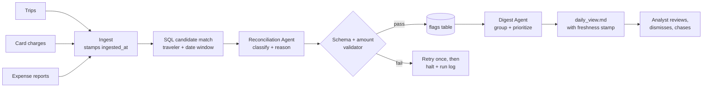

# PRD — T&E Visibility Agent

Sep 24, 2026 · @Ashraf Abu Talib

A T&E visibility tool for strategic finance managers: it shows how much travel budget is left today for each team and cost centre, ties every expense to its trip and purpose, flags spend charged to the wrong cost centre, and lets the team test trip scenarios against what's left. Two Claude agents reconcile trips, card charges and expense reports behind it. Success means about 2 hours back on a busy day, no month-end overspend surprises, and numbers finance can trust to the cent.

## Problem statement

Finance managers can't see how much T&E budget is left today, so overspend only shows up at month end.

- **No real-time view:** expenses don't show until reports are filed and posted, so no one can say how much of the year's budget is left right now.
- **No transparency on what each expense was for:** people get confused about which charge belongs to which trip or purpose, and there is no audit trail on recent spend.
- **Wrong cost centre, the "shell game":** spend gets charged to the wrong cost centre, which makes it hard to readjust future spend. For example, a team spends 8k against one cost centre, then balances it by pulling the same amount from another team's or trip's budget.

Why it's hard to fix by hand:

- **Three disconnected systems:** trips, corporate-card charges and expense reports sit apart. The only link between them is a traveler's name and a date window.
- **Today's workaround:** someone exports all three, lines them up in a spreadsheet and chases travelers by email. That works for one person, but at 200 travelers it takes hours and goes stale as soon as it's done.
- **Messy data:** upcoming trips with no charges yet, partial reports, card charges that match no trip, and overlapping trips for the same traveler. Simple joins either miss these cases or double-count them.
- **Why an agent:** the matching rules are fuzzy (merchant names, travel dates versus charge dates, split reports, which cost centre a trip belongs to). An LLM can classify each case and explain why. Deterministic code keeps the numbers honest.

## ICP

**A strategic finance manager or finance lead** who owns T&E budget for several teams that travel globally, with many expenses landing every week and month. They answer for landing the year on budget, and today they rebuild the picture from spreadsheets.

Other people use the output second-hand:

| User | What they need | Current workaround | Touchpoint |
| --- | --- | --- | --- |
| Strategic finance manager (ICP, admin) | Budget left today per team and cost centre, and which trips to drop or move | Spreadsheet three-way match, month-end surprises | Budget view, scenario planner, flags |
| Traveler / team member (user, about 200) | What they can still spend, and which charges they still owe a report on | Reminder emails with no detail | Log expenses as they happen, own remaining budget (P1: a direct nudge) |
| Team lead | Their team's spend against budget, and who is overdue | Asks finance ad hoc | Team roll-up (P1) |
| Finance-ops analyst | Clean, matched data and fewer chases | Exports and a spreadsheet | Flags table for drill-down |
| Controller / audit | Proof the numbers are right and every flag and reallocation can be traced | Samples the spreadsheet by hand | Run log, eval scores, per-flag reasoning |

## Jobs to be done

Written from the ICP's seat.

1. Keep spend under the planned budget, and on forecast to land under or close to it on time.
2. See how much money is in the pot today, so the team knows how much it can spend.
3. Analyze and plan scenarios for expected spend, so the team can decide which trips to drop or adjust.

## Goal: ideal-case testimonials

What we want the ICP to say after the pilot. Each quote maps to a metric below, so we can tell whether we got there.

| What we want to hear | Metric that tests it |
| --- | --- |
| "We saved 2 hours on a busy day making sure our T&E was on track, and had no unexpected overspend at the end of the month." | Time saved; month-end surprise |
| "We fit all our trips and expenses into the budget we had, by readjusting and optimizing trips and their sequencing." | Scenarios used before trips are cut or moved; month-end surprise |
| "Our team no longer thinks twice about what they can spend, because it shows the latest numbers for individuals and the team as a whole." | View age; share of users logging expenses as they happen |
| "I wish I had this for my own personal or family trips, because then I'd no longer have to think about financial planning." | Qualitative pull; a signal for P2 story 20 |

## Objectives and success metrics

The PRD tracks four things: time saved for the finance manager, budget control (no month-end surprises), accuracy of the numbers and the cost-centre coding, and how fresh the data is. Every target below is proposed. Baselines get measured in week 1 of the pilot, not assumed.

**Goals**

- Show budget remaining today for each team and cost centre, replacing the manual spreadsheet.
- Tie every expense to its trip, purpose and cost centre, and surface miscoded spend before it gets balanced out elsewhere.
- Let the finance manager test trip scenarios against the remaining budget and the year-end forecast.
- Publish amounts finance can report without re-checking, fresh enough that people act on current numbers.

**Non-goals**

- Approving expense reports or writing back to source systems. Users can log an expense as it happens, but it stays an in-app record until the official report lands. Cost-centre reallocations are recorded here, and a human makes them in the source system.
- Setting budgets. We read the approved budget per cost centre; planning it stays in the existing tool.
- Policy enforcement (per-diem limits, out-of-policy spend). That's a separate problem with separate owners.
- Replacing the card, travel or expense systems. We read from them and never write back.

**Success metrics**

| Metric | Definition | Phase 1 target (daily batch) | Phase 2 target (event-driven) | How measured |
| --- | --- | --- | --- | --- |
| Time to reconcile: run time | Wall-clock time for one full reconciliation run | < 5 min for 200 travelers | < 30 s per changed trip | Run log start and end timestamps |
| Time saved | Finance manager hours spent checking T&E is on track, per week (goal: about 2 h back on a busy day) | -80% vs. week-1 baseline | -90% vs. baseline | Time study before and after |
| Time to resolve | Days from a flag being raised to it being cleared | Median ≤ 5 business days | Median ≤ 3 business days | `flags.created_at` to `resolved_at` |
| Accuracy: status | Share of trips classified correctly (fully / partially / unexpensed / anomaly) | ≥ 95% on gold set | ≥ 98% on gold set | Eval against a hand-labeled gold set, run on every prompt or model change |
| Accuracy: amount | Share of outstanding amounts exact to the cent | 100% | 100% | Recomputed deterministically in SQL and diffed against agent output |
| Accuracy: false alarms | Share of flags a human marks "not an issue" | ≤ 5% | ≤ 2% | Dismiss reason on each flag |
| Accuracy: cost-centre coding | Share of miscoded charges flagged with the right suggested cost centre | ≥ 90% on gold set | ≥ 95% on gold set | Seeded miscodings in the gold set; admin accept / reject on each suggested reallocation |
| Accuracy: import fidelity | Share of imports whose row counts and sums match the source file's control totals | 100% (otherwise the import halts) | 100% | Control-total check logged on every import |
| Audit: change traceability | Share of changes (app edits, uploads, agent runs) with actor, timestamp, old and new value | 100% | 100% | Nightly audit-log completeness and hash-chain check |
| Freshness: source lag | Now minus the newest ingested record, per source | ≤ 24 h | ≤ 1 h | `max(ingested_at)` per source table |
| Freshness: view age | Age of the published digest when it's read | ≤ 24 h | ≤ 1 h | `generated_at` stamped on the digest |
| Budget control: month-end surprise | Month-end T&E overspend per cost centre that the view did not show beforehand | 0 per quarter | 0 per quarter | Month-end close compared with the view on the last business day |
| Budget control: forecast error | Gap between the forecast year-end spend and actuals, checked each month end | Set after pilot | Within ±5% | Forecast snapshot vs. closed actuals |
| Guardrail: cost | Model spend per full run | Set after first run; alert at 2× | Same | Token usage in the run log |

## User stories and features

Admin = the strategic finance manager (the ICP); user = a traveler or team member. The P0 stories make up the 4-hour build. P1 and P2 are what it takes to run at 200 travelers. Each story states what success looks like, tied back to the metrics.

**P0: must have**

| # | User story | Feature | What success looks like |
| --- | --- | --- | --- |
| 1 | As an admin, I want to see how much budget is left today for each team and cost centre, so the team knows how much it can spend. | Budget view: approved budget minus actuals (card + expense) minus committed spend (booked trips), computed in SQL. The Digest Agent publishes it daily as daily\_view.md. | Remaining budget matches the SQL recomputation to the cent. Stamped with generated\_at and each source's lag. Ready by 08:00. |
| 2 | As an admin, I want to model scenarios for expected spend, so the team can decide which trips to drop, adjust or resequence. | Scenario planner: add, remove or shift planned trips with an estimated cost, and see projected year-end spend against budget per cost centre | Each scenario shows projected spend and headroom per cost centre. Scenarios never change actuals. |
| 3 | As an admin, I want expenses charged to the wrong cost centre flagged, so the "shell game" is visible and I can readjust future spend. | Cost-centre check: compare each charge's cost centre with its trip's owning team. The agent flags mismatches with a reason and a suggested reallocation. | ≥ 90% of seeded miscodings flagged. Every reallocation the admin accepts is logged with a reason. |
| 4 | As an admin, I want every expense tied to its trip and purpose, with a status, so I can see and audit what each one was for. | Reconciliation Agent: match on traveler + date window, classify as fully / partially / unexpensed / anomaly (orphan charges, overlapping trips, reports with no trip) | ≥ 95% status accuracy on the gold set. Each flag has a one-line reason citing row ids. Zero card charges left without a match or a flag. |
| 5 | As an admin, I want amounts I can trust to the cent, so I can report them without re-checking. | Amounts computed in SQL. The model classifies and explains but never does the arithmetic. | 100% of amounts match the deterministic recomputation. |
| 6 | As a user, I want to submit my expenses in real time and know how much I'm spending, so I know what I have left. | Quick log (amount, trip, cost centre, receipt). It counts as pending against the budget straight away, then matches to the card charge when it lands. | A logged expense shows in the budget view within 1 min. Zero double counts once the card charge arrives. |
| 7 | As an admin, I want the run to fail loudly rather than publish bad numbers. | Harness: JSON schema validation, one retry, halt after N consecutive failures, a log of every input and output | Malformed output never reaches flags. Zero partial runs get published. |
| 8 | As a controller, I want no automated changes to expense records. | Read-only access to source systems. Admins dismiss a flag or accept a reallocation with a reason. | Zero writes to source systems. Every dismissal has a reason, which feeds the false-alarm metric. |
| 9 | As an admin, I want to import our existing budget and expense spreadsheets and know nothing was lost or misread. | Import with one registered source per dataset, a saved column mapping, control totals (rows and sums) checked against the file, and the file hash and version recorded. Column drift halts the import. | 100% of seeded files import with matching control totals. 100% of seeded schema changes halt instead of guessing. |
| 10 | As an admin, I want to see every change (who made it, when, and the old and new value) so no one can move money around unseen. | Append-only audit log for app edits, agent runs and uploads. Each new upload is diffed against the last and shown as a change report. | 100% of changes carry actor, timestamp, old and new value. 100% of seeded sheet edits show in the change report. Audit rows can't be edited or deleted. |

**P1: should have**

| # | User story | Feature | What success looks like |
| --- | --- | --- | --- |
| 11 | As an admin, I want a year-end forecast, so I know whether we will land under or close to budget on time. | Forecast in the budget view: actuals + committed + planned trips, against budget per cost centre | Forecast error within the target at each month end. |
| 12 | As a user, I want to be told exactly which charges I still need to expense. | Drafted nudge per traveler, reviewed and sent by a human | Median time to resolve falls from the Phase 1 level toward ≤ 3 days. |
| 13 | As a team lead, I want my team's spend against budget, and who is overdue, in one line. | Team roll-up in the digest | Totals for each team equal the sum of their travelers' rows. |
| 14 | As an admin, I want to know who to chase first. | Digest ranks travelers by amount × days outstanding | Digest totals equal the sum of flags to the cent. |
| 15 | As an admin, I want to know when the numbers are stale before I act on them. | Freshness banner. The digest warns when any source lag exceeds its threshold. | 100% of digests show lag per source. Stale-data warnings fire within one run. |
| 16 | As a controller, I want proof that accuracy holds after every change. | Evals: gold set of labeled cases (including miscoded cost centres, spreadsheet drift and edits between uploads), run on every prompt or model change, blocks the release if accuracy drops | No release ships below the accuracy targets. |

**P2: future**

| # | User story | Feature | What success looks like |
| --- | --- | --- | --- |
| 17 | As an admin, I want the budget to update as charges land, not once a day. | Event-driven refresh: re-reconcile only the trips a new record touches | Source lag and view age ≤ 1 h. |
| 18 | As an engineer, I want the agent to query data through tools, not hardcoded SQL. | Supabase MCP server as the agent's tool surface | Same accuracy on the gold set with no hardcoded queries in the agent. |
| 19 | As an admin in a multi-currency org, I want amounts normalized. | FX conversion at the charge-date rate, keeping the original currency | 100% of amounts carry both the original and the reporting currency. |
| 20 | As a user, I want the same view for my own personal or family trips. | Personal mode: one budget, no cost centres | Pilot users ask for it unprompted. Scoped only after Phase 3. |

## Architecture

SQL does the candidate matching and the money math. Claude does the judgment: classifying each case and explaining it. A validator sits between the model and the database.

The handoff between the two agents is a database table, not shared memory. Each stage can be re-run, inspected and audited on its own.

| Component | Responsibility | Built with |
| --- | --- | --- |
| Ingest | Load the three sources and stamp `ingested_at`. Reject rows that fail the schema and log them. | Python + Supabase client |
| Import and mapping | One registered source per dataset (budget sheet, trip plan, card feed, expense export). Apply the saved column mapping, check control totals, record file hash and version, and diff against the last upload. Halt on column drift. | Python + Supabase Storage |
| Candidate match | For each trip, pull charges and report lines for that traveler within start date − 3 days to end date + 30 days | SQL view |
| Budget and scenarios | Load the approved budget per cost centre. Compute remaining = budget − actuals − committed, the year-end forecast and scenario deltas. Include user-logged expenses as pending until matched. | SQL views |
| Reconciliation Agent | Classify the status, flag a likely cost-centre miscoding with a suggested reallocation, and write a one-line reason that cites row ids. Returns JSON only. | Claude, structured output |
| Validator | Check the JSON schema and the status enum. Replace the model's amount with the SQL-computed outstanding amount and log any mismatch. | Python |
| `flags` table | `trip_id, traveler, cost_centre, suggested_cost_centre, status, amount_outstanding, reason, run_id, created_at, resolved_at, dismissed_reason` | Supabase Postgres |
| Digest Agent | Group flags by traveler, rank by amount × days outstanding, write a plain-English summary | Claude |
| Run log | Inputs, outputs, tokens, latency, errors per run: the audit trail and the source for the metrics | `runs` table + stdout |
| Audit log | Append-only record of every change: actor (user or agent run), timestamp, object, old value, new value, reason. No role can update or delete it. Hash-chained and verified nightly. | Postgres table + trigger |

## Model choice

Move off Opus 5. The Reconciliation Agent runs on Claude Sonnet 5 and the Digest Agent on Claude Haiku 4.5. A full 300-trip run drops from about $4.50 to about $1.00 in real time with prompt caching, under the $1.50 target, and to about $0.50 through the Batch API (approximate, list prices as of 2026-09-28, [source](https://platform.claude.com/docs/en/about-claude/pricing)).

| Agent | Model (input / output per MTok) | Settings | Why | Cost per run (approx.) |
| --- | --- | --- | --- | --- |
| Reconciliation Agent | Claude Sonnet 5 ($2 / $10) | Thinking off or low effort. Structured output with a JSON schema for {status, reason, matched\_ids, suggested\_cost\_centre}. System prompt and schema cached. | Status and cost-centre calls are what the finance manager judges us on. Sonnet handles that judgment at 40% of Opus's price. | $1.00 real time, $0.50 batched |
| Digest Agent | Claude Haiku 4.5 ($1 / $5) | Plain text, no thinking | It summarizes rows that are already validated, so the facts are fixed | Under $0.05 |
| Eval judge | Claude Haiku 4.5 | Fixed rubric, 10 reasons per run | Scores against a rubric checked by a human | Under $0.02 |

- **Why not Opus:** SQL does all the arithmetic, and the model only classifies candidate rows against explicit rules. Opus's extra reasoning isn't where our errors come from. If the eval shows Sonnet struggling on the hardest cases, only those (needs\_review, expected under 10%) escalate to Opus 5.
- **Where I'd push back on going all-Haiku:** Haiku 4.5 on reconciliation would save roughly another $0.50 per run. But a wrong flag or a missed shell-game charge costs more trust than it saves. We test Haiku 4.5 on the starter set; if flag agreement and recall hold at target, switching is a config change.
- **Cost levers:** cache the fixed system prompt and schema (cache reads cost 10% of input). Send only each trip's candidate rows as compact JSON. Batch the nightly run in Phase 1 for a further 50% off.
- **Rough cost basis (approximate):** 300 open trips, each about 1,500 fixed prompt tokens (cached) + 500 variable tokens in, and about 200 tokens out. Thinking tokens bill as output, so keep effort low.
- **Safety net:** handle a refusal stop reason explicitly and turn on server-side fallbacks, so one declined record fails over instead of halting the run.

## Failure modes

The most dangerous failure is a wrong number that looks right. So the design favors halting loudly over publishing silently, and never lets the model do arithmetic.

### Most relevant risks for this context

Three risks matter most before we build: bad data going in, fragile links to the finance team's existing systems and spreadsheets, and changes nobody can trace. Each one needs a check that runs automatically and an eval that proves it works.

**1. Incorrect data**

| Failure mode | What it looks like here | How we detect it | How we contain it | Eval metric |
| --- | --- | --- | --- | --- |
| Wrong figures in a source sheet | A budget tab says 120k for a cost centre; the approved figure is 100k. A formula was overwritten with a typed number. | Budget total checked against the last approved version. Hard-coded cells flagged where a formula is expected. | Budget counts only from a registered, approved version. A revision needs admin sign-off before it changes the remaining budget. | Import fidelity |
| The same spend counted twice | One dinner appears as a user-logged expense, a card charge and an expense report line | Each spend links to one canonical record. Unlinked pairs are listed. | SQL counts each spend once. Unmatched logs stay pending and are shown apart from actuals. | Calculation accuracy |
| Timing gaps make the view look wrong | A hotel folio posts 20 days after the trip. The card feed and the ledger close the month on different days. | Per-source lag. Transaction date vs posting date on every row. | Show committed, pending and posted spend separately. Freshness banner when a source is late. | Freshness |

**2. Integrating with existing systems and spreadsheets**

| Failure mode | What it looks like here | How we detect it | How we contain it | Eval metric |
| --- | --- | --- | --- | --- |
| Columns renamed, moved or added | "Cost Ctr" becomes "Cost centre"; a new FY27 tab appears | Every import is checked against the saved column mapping for that source | Unknown or missing columns halt the import and ask the admin to confirm the mapping. We never guess. | Schema-drift handling |
| Several versions of the same sheet | Budget\_v3\_final.xlsx on SharePoint and an edited copy on someone's desktop | File hash and version recorded. One registered location per dataset. | Only the registered source counts. Anything else is rejected with a message saying which file is the source of truth. | Import fidelity |
| IDs don't line up across systems | Names in the sheet, employee IDs in the card feed. Cost centres written "CC-104" in one place and "104" in another. | Match rate per join key. Unmatched rows listed. | An admin-owned mapping table. Unmatched rows go to needs\_review, never to a best guess. | Match F1, abstention |
| Spreadsheet quirks | Merged cells, hidden rows, subtotal rows, numbers stored as text, mixed currencies in one column | Ingest schema checks. Row count and sum compared with the file's own totals. | Bad rows rejected and logged, subtotals excluded by rule, "n rows skipped" shown on the view | Import fidelity |
| Partial or failed export | The card file cuts off at 10,000 rows | Row count and sum against the file's control totals and the previous day | The whole import is held. Yesterday's view stays up, marked stale. | Import fidelity |

**3. Unclear visibility on changes**

| Failure mode | What it looks like here | How we detect it | How we contain it | Eval metric |
| --- | --- | --- | --- | --- |
| A sheet changes after import and nobody notices | A budget line is cut from 50k to 40k with no note | Each upload is diffed against the last one: rows and cells added, removed or changed | A change report on the home screen shows what changed, which file version, who uploaded it and when. The admin acknowledges material changes. | Change detection |
| An edit in the app has no owner | A status override, a cost-centre reallocation, or a scenario promoted to plan | Every write goes through one audit function. A database trigger rejects writes with no actor. | Append-only audit log: who, what, when, old value, new value and reason. Agent changes carry their run id, so a human can see why a number moved. | Audit completeness |
| The audit trail itself is changed | Someone deletes the entry for a reallocation | Hash chain over the log rows, verified nightly | No role can update or delete audit rows, admins included | Tamper test |

### Pipeline and model failure modes

The table below covers how the agents and the pipeline can fail, whatever the data source.

| # | Failure mode | Metric hit | How we detect it | How we contain it |
| --- | --- | --- | --- | --- |
| 1 | Model states a wrong outstanding amount | Accuracy | Validator diffs it against the SQL recomputation | The SQL amount always wins. The mismatch is logged, and more than 2% mismatches in a run halts publish. |
| 2 | Misclassification (e.g. partial marked as full, so spend goes unchased) | Accuracy | Gold-set eval on every change, plus the false-alarm rate from dismissals | Release gate on the eval. "Fully expensed" requires amount outstanding = 0 in SQL, whatever the model says. |
| 3 | Wrong match: charge tied to the wrong trip (overlapping trips, same-name travelers) | Accuracy | Charges matched to more than one trip. Name collisions on `traveler`. | Match on employee ID, not name. Ambiguous matches get classed as anomalies for a human. |
| 4 | Orphan charge silently dropped | Accuracy | Coverage check: every card charge appears in a match or a flag | Run fails if coverage < 100%. |
| 5 | Malformed or missing JSON | Time to reconcile | Schema validation | Structured outputs prevent most cases. One retry, then the trip is marked `needs_review` rather than guessed. |
| 6 | Null or bad source data (null `end_date`, negative amounts, duplicates) | Accuracy | Ingest schema checks | Bad rows are rejected and logged, and shown in the digest as "n rows skipped". |
| 7 | Stale source feed (card file didn't arrive) | Freshness | Per-source lag exceeds the threshold | The digest shows a stale-data banner. We don't present stale numbers as current. |
| 8 | Run exceeds time or cost budget as data grows | Time to reconcile | Run time and token spend in the run log | Reconcile only trips that changed since the last run. Alert at 2× the cost baseline. |
| 9 | API outage, rate limit or refusal | Time to reconcile, freshness | Error codes in the run log | SDK retries plus server-side fallback. Halt after N consecutive failures and keep yesterday's digest, marked stale. |
| 10 | Prompt injection via free-text fields (merchant names, report notes) | Accuracy | Reasons that cite instructions rather than rows | Free text is passed as data, not instructions. The agent has no write tools and output is schema-bound. |
| 11 | Over-flagging erodes trust (travelers chased for spend they've already filed) | Accuracy | False-alarm rate above 5% | Allow a grace window after the trip ends before flagging. A human reviews nudges before sending. |
| 12 | Sensitive data exposure (personal spend, merchant detail) | n/a (compliance) | Access review | Digest limited to finance ops and managers. No raw card numbers stored. Data-residency choice is an open question. |
| 13 | Miscoded cost centre missed, or a correct one flagged | Accuracy | Seeded miscodings in the gold set. Admin reject rate on suggested reallocations. | Suggestions only: the admin accepts or rejects each one, and rejects feed the eval. |
| 14 | User-logged expense double-counted when the card charge lands | Accuracy, budget control | Coverage check: each logged expense pairs with at most one charge | Unmatched logs stay pending and are shown separately. The SQL total counts each spend once. |

## Open questions

- What is today's baseline: finance manager hours per week on T&E, and how often month end brings an overspend surprise?
- Which spreadsheets are in play today (budget, forecast, trip plan, reallocations), who owns each, and where do they live?
- Do those sheets keep version history we can read (SharePoint or OneDrive), or is our upload the first record of a change?
- Which changes need sign-off before they count (budget revisions, reallocations), and by whom?
- Where does the approved budget per cost centre live (planning tool, spreadsheet), and how often is it revised?
- How is a trip's "right" cost centre decided: the traveler's home team, the trip sponsor, or a code set when the trip is booked?
- Is a user-logged expense only an in-app record, or should it start a draft in the expense system?
- What grace window after a trip ends counts as "overdue" (7, 14 or 30 days)? This drives the false-alarm rate.
- Is there a stable employee ID in all three sources, or only names?
- How often does each source refresh (card feed daily or intraday)? This caps achievable freshness.
- Data residency and retention: can card and expense data go to a hosted model API, and in which region?
- Who labels the gold set, and who signs off on the accuracy targets?

## Timeline and phasing

| Phase | Scope | Exit criteria |
| --- | --- | --- |
| 0: Interview build (4 hours, today) | P0 stories 1–10 on seeded messy data and spreadsheets, including miscoded cost centres | All seeded edge cases and miscodings flagged correctly. Remaining budget and digest totals match SQL. Pushed to GitHub. |
| 1: Pilot (weeks 1–4) | Real exports for one team (\~20 travelers), daily batch, gold set, P1 stories 15–16 | ≥ 95% status accuracy. 100% amount accuracy. Source lag ≤ 24 h. Baseline hours and month-end surprises measured. |
| 2: Roll-out (weeks 5–10) | All \~200 travelers, P1 stories 11–14 (forecast, nudges, team roll-up, chase list), incremental reconcile | Run time < 5 min. Finance manager hours down 80%. False alarms ≤ 5%. No month-end surprise. |
| 3: Near-live (after week 10) | P2 stories 17–19: event-driven refresh, MCP tool access, FX | Freshness ≤ 1 h. Accuracy targets held. |

The main dependency is read access to the card and expense feeds. Phase 1 can start on manual exports if API access lags.
